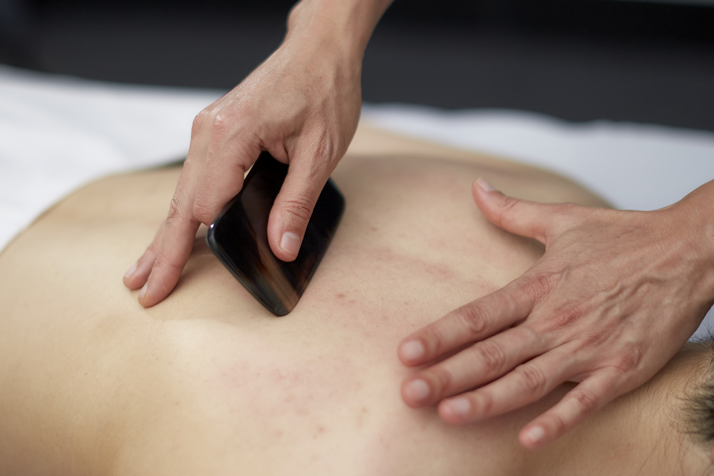
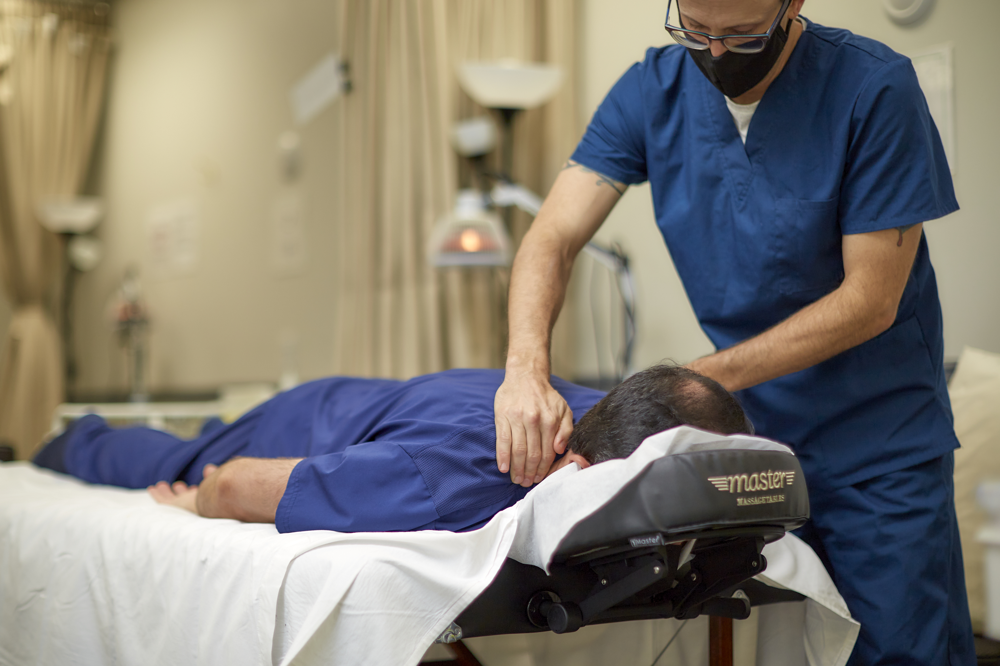

You're thinking about studying acupuncture, you've been doing your research on the sources of education available, but how do you make the final decision? Hopefully, we can help guide you in the right direction with this comprehensive guide to choosing the right school for you!

### Why do you want to be an acupuncturist?

Do you dream of opening your own clinic? Or would you rather work alongside doctors in an integrative hospital setting? Would you specialize into treating infertility? mental illness? or perhaps go the cosmetic route? All of these questions must be taken into consideration when choosing the right school for you. Some institutions have instructors that specialize in the treatment of certain illnesses, and they would love to pass on their knowledge to you! Try looking into the instructors and faculty for particular fields of interest! Our instructors are always happy to pass on knowledge or answer questions, just get in touch!

### How qualified are the instructors?

Any acupuncturist can practice acupuncture, but it takes a certain level of expertise to teach! Some green flags are:

* Many years in the industry
* A history of teaching at other institutions
* A genuine passion for TCM and sharing knowledge

A good instructor can make a class and a bad one can break it! Choose carefully as you always want to be studying in a positive school environment where you feel supported and welcomed. A good college will always put their students first when selecting the best of the best to teach! 

### What courses and programs are available?

Every program is different, so make sure you review the curriculum to determine if you like what you see. You'll be in the program for a few years so definitely choose one that appeals to you! Do you want to maybe pursue herbology after graduation? Or perhaps you want to become a R. TCMP? Finding a college that also has additional post-grad programs available could also be helpful in furthering your career and expanding your knowledge! After all, the scope of TCM is so huge that there's always something new to learn. Here at Eight Branches, our programs are diverse and cover all Eight Branches of Eastern Medicine, so there's definitely something for everybody.

### Is the curriculum comprehensive and complete?

While a strong scholastic foundation is indispensable for your career, it is important that a curriculum offers a balance of textbook knowledge, hands-on practice, and active cultivation of the lifestyle that grounds one’s practice. Does the school walk the talk? Eight Branches offers complete and comprehensive courses in both Professional Diploma and Continuing Education Programs. The Eight Branches program distinguishes itself by offering an in-depth training in TCM theory, diagnostics, nutrition and herbology, as well as the more practical applications including acupuncture, moxibustion, bodywork, gua sha and cupping. Another unique aspect of the Eight Branches curriculum is the incorporation of practical Western medical components to the program.  In addition to teaching standard medical theory, terminology and techniques, we place a strong emphasis on learning relevant materials and applying it to clinical practice.  Our students learn how to take a complete physical, including the appropriate language to communicate with both Western medical physicians and patients who have had limited exposure to Asian medicine. In an integrative society, we recognize the need for our students to feel comfortable understanding complex medical conditions from both an Eastern and Western perspective. We firmly believe that this element of our program expands the personal growth of our students and equips them with the ability to cope with the physical and psychological demands of their chosen career. The guiding principle of this philosophy is “first you must learn to treat yourself, then to treat your family and then to treat your community”.

### Have you visited the campus?

It's very important that you enjoy the learning environment you're in! That's why we always recommend visiting the school before committing to a decision. Most acupuncture colleges will allow walk-ins for a simple look around, although joining an open house would be the best opportunity to see what a college has to offer. Appointments can always be made to meet with an admissions advisor or a treatment at student clinic! Make sure to watch for signs of good school culture. Are the staff and students friendly and enthusiastic? Is the space clean and orderly? Does the college carry an air of professionalism? All great points to keep in mind.

### Where is the school located?

Is the school conveniently located? Will you be able to reach the campus safely and with ease? What is the surrounding neighbourhood like? Eight Branches is located at Yonge and Davisville. We are a short walk from Davisville subway station. There is ample parking in the area. Our location is in the heart of the Midtown Toronto neighborhood, which is one of Toronto’s most vibrant, family-friendly neighborhoods – rich in character and with a long history of embracing healthy and community-focused lifestyles.

### How good are their PAN-Canadian exam pass rates?

The proof is in the pudding! The best way to gauge a school's success is determining whether or not they've set up their students for success! The PAN-Canadian exam is an exam that gauges the competency of entry-level TCM professionals, and a passing grade is required for registration as an R. Ac or R. TCMP. Think of it as a bar exam for acupuncturists! Eight Branches has a 87% PAN-Canadian exam pass rate, as opposed to the Ontario average of 69%. We pride ourselves on providing a comprehensive education that is tailored to help students pass the necessary exams and build a successful professional practice.

### How does the school prepare you for successful entry into the professional field?

The primary goal of any school should be to prepare their graduates for the development of their professional practice. At Eight Branches we offer our students a comprehensive education including TCM foundations, theory, diagnosis and therapeutics. Eight Branches puts a great emphasis on this by training our students in Practice Management and Business Development and by offering all of our graduates mentorship opportunities to facilitate a smooth transition into the workforce.

If you've made it this far, you're obviously pretty serious about beginning a career in acupuncture! We'd love to help you get started. You can book an appointment to speak with an advisor using the link [here.](https://eightbranches.youcanbook.me/)