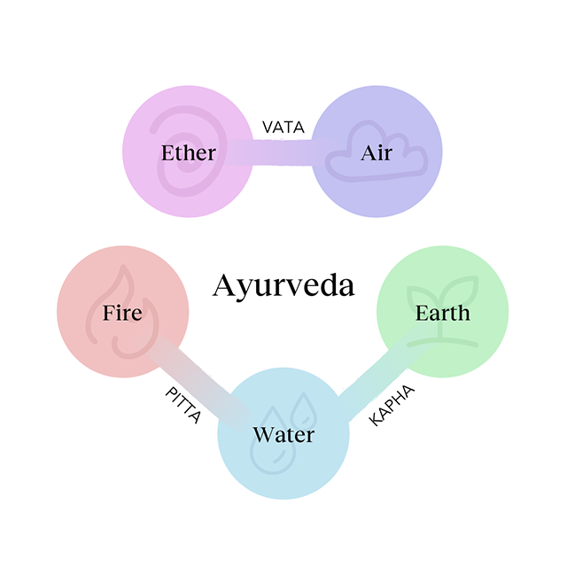
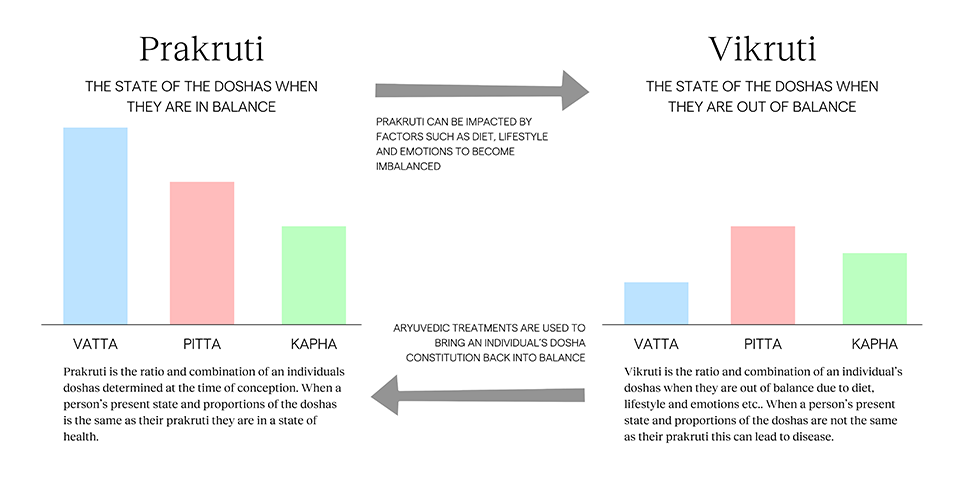
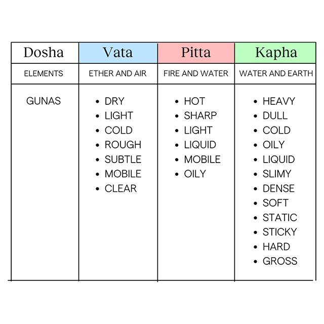

Ayurveda is a traditional system of medicine that is rich in history and has been practiced in India for over 5000 years. The word *Ayurveda* means “the science of life” and comes from the Sanskrit terms *Ayu* meaning ‘life’ and *Veda* meaning ‘knowing’. Ayurveda is one of the world’s oldest systems of medicine; it was first recorded in the Vedas, it defines health as state of equilibrium of the four dimensions Sharira (the physical body), Indriyas (the senses), Satva (the mind) and Atma (the soul). 

Ayurvedic practitioners address all four dimensions of health when treating patients and understands disease to be caused by disturbance in one’s life equilibrium. This disturbance in equilibrium is caused by imbalances of the five elements that make up all of matter; ether (space), air, fire, water and earth which are further grouped into the three Doshas. *Dosha*, coming from the Sanskrit word meaning “fault” are the functional energies that govern all the biological, psychological and pathological functions of the body, mind and consciousness; Vata, Pitta and Kapha comprise the Tridosha. The five elements bind the doshas; ether and air manifest the air principal vata, fire and water manifest the fire principal pitta and earth and water manifest the water principal kapha.

Each individual is determined by different ratios and combinations of the doshas that is set at conception which comprises their unique constitution known as Prakruti, this is governs a person’s biological functions, response to environmental factors and susceptibility to diseases etc. Individuals are a combination of all three doshas with one or two predominant, for example a person can be PV which means they are mostly pitta with a secondary characteristic of vata; this person with a predominant pitta dosha prakruti may be susceptible to pitta diseases such as acidity, ulcers and rashes.  

Vikruti comes from the Sanskrit term *Vikru* meaning “to alter” and it refers to the present state of an individual’s dosha, if the present state and proportions of the doshas is the same as a person’s prakruti they are in a state of health, however vikruti tends to be more of an imbalance in the doshas leading to a state of disease, as a result of differences in diet, lifestyle, emotions etc. Individuals should strive to bring their constitution back into balance with their prakruti to achieve a state of wellness. 

Ayurvedic practitioners use prakruti to develop treatment plans to restore the health of their patients and it can be determined using the clinical assessment techniques of observation, questioning and touch. Some areas of assessment of vikruti include pulse, tongue, lip, nail and face. Treatments are a combination of nutrition and lifestyle recommendations, herbology and cleansing therapies that are personalized to the individual.

Ayurveda utilizes the laws of nature with a concept of healing based on the premise of like increases like and opposites balance, this means that increasing the inherent qualities/attributes of the dosha will increase the quantitative expression of the dosha in your body. There are 20 Gunas also known as qualities which define the doshas (see table below); for example, the fire element has the characteristics of being hot and sharp which are qualities associated with pitta dosha and the air element has the characteristics of being dry and light which are qualities of vata. The Gunas which are made up of 10 opposing pairs of qualities that are used to help bring the individual back into a state of equilibrium. For example, the summer season has attributes similar to pitta and will therefore increase or aggravate pitta dosha in your body – opposite attributes such as cold and heavy and the water element would be used across herbology, therapy and diet to reduce pitta. 

The doshas are the foundation of Ayurvedic philosophy and are present in everyone and everything. This invaluable system of medicine teaches individuals to maintain their health or regain health with the basic concept of promoting the ability of self-healing through the balance of the tridosha.