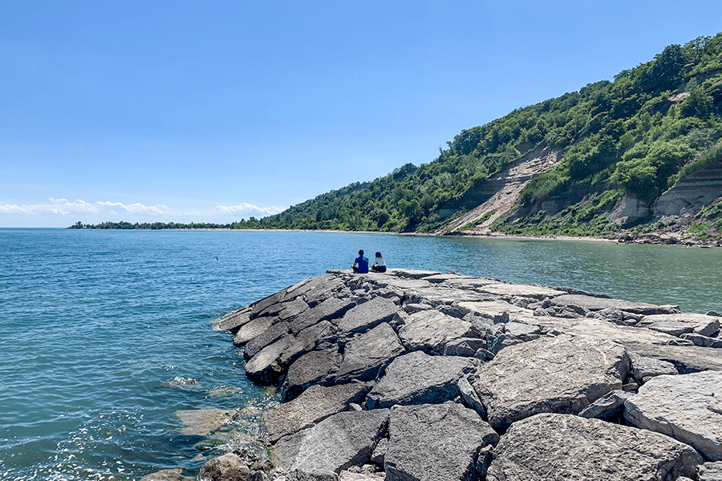
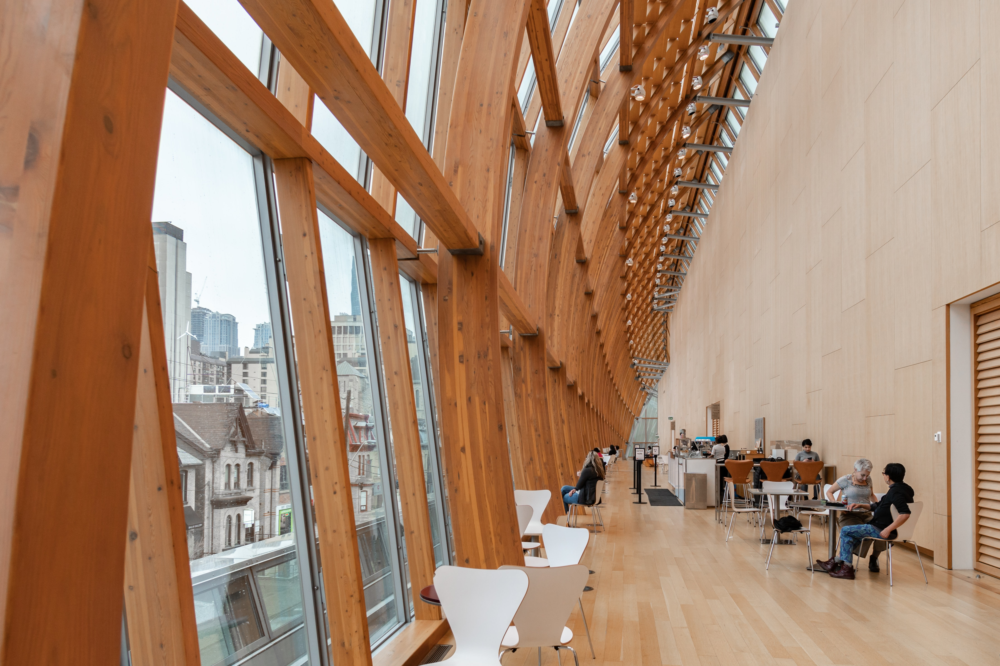
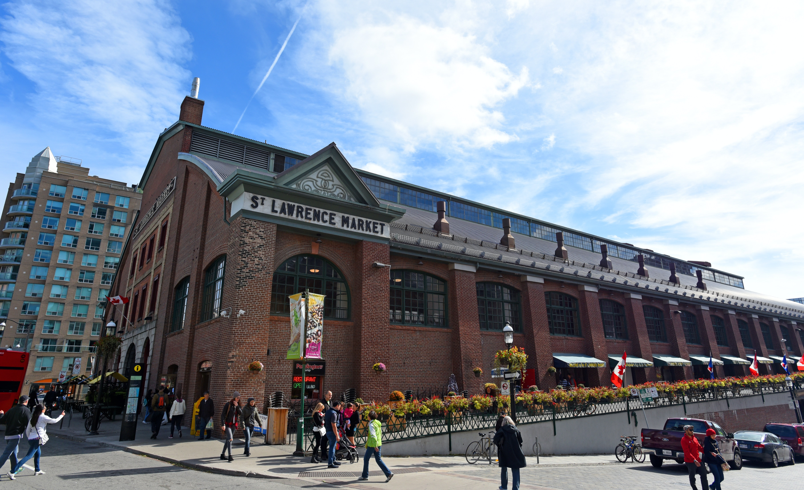
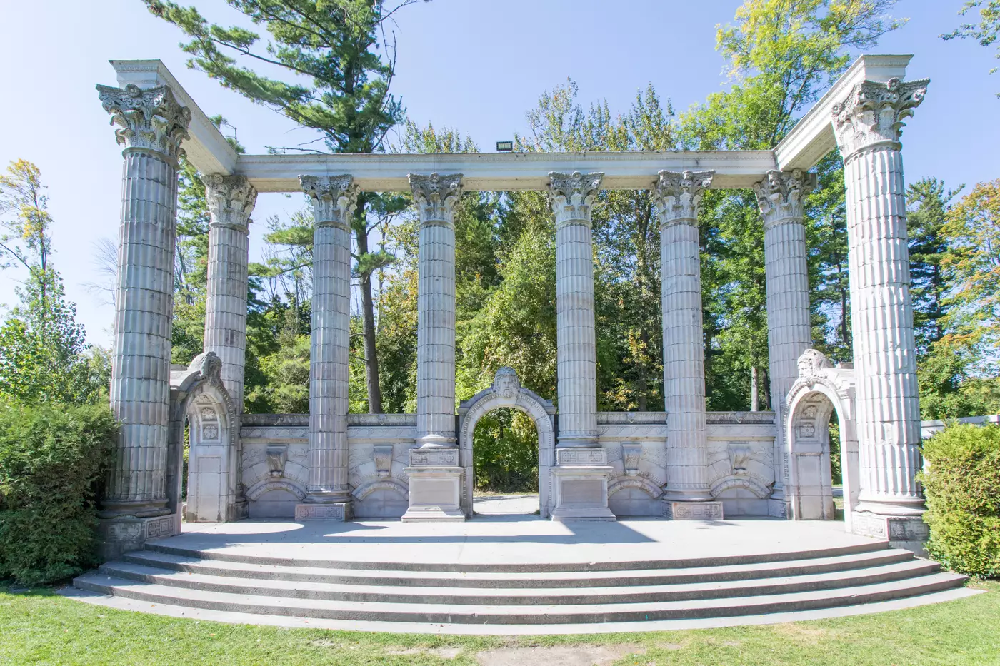
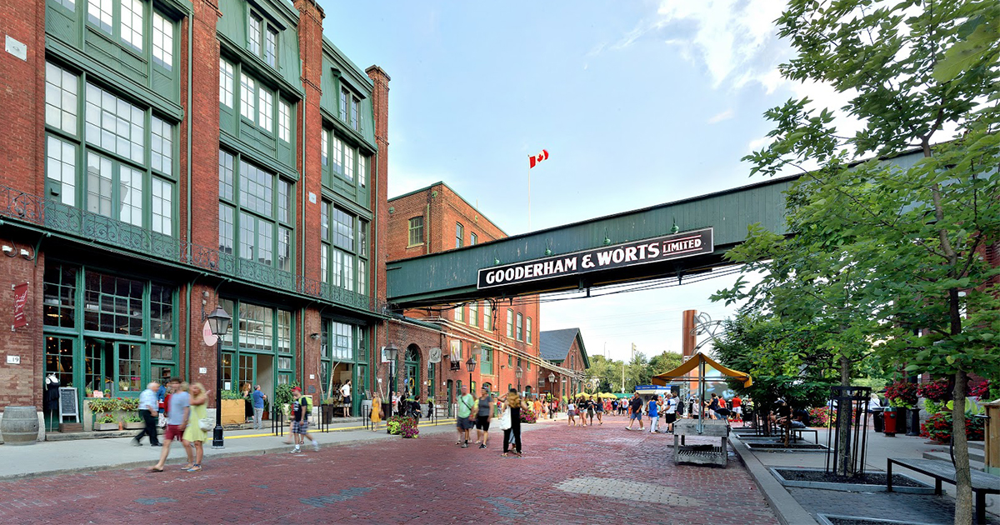

I know Toronto from the back of my head. Being born and raised here has taught me so many things and along the way it's brought me to some awesome places within the city. Hi, my name is Adeela, and I'd like to say I'm a tourist in my own city. This spontaneous spirit of mine has led me to wander parts of Toronto that I have grown to love so much, and I'm still exploring new places every single day!\
\
With Toronto being a big city, it can be quite difficult to know where to go or what to do. Being that Toronto is my hometown, it's allowed me to venture off and find all the little and big things the city has to offer. Being that Toronto is so diverse - there really is something here for everyone to enjoy. Now through my experience, I have piled up the best places to experience Toronto at its core. 

Be prepared because I will be unlocking some of Toronto's hidden gems (growing up here you find yourself wandering off and discovering some cool places) as well as some of the local touristy spots!

## **1. Doris McCarthy Trail**

If you're up for a hike and an awesome view this spot is great to go with a buddy or even spending some time alone. Leads from Ravine Drive, which takes you down a pathway that will take you to a beautiful view of Lake Ontario and the Scarborough Bluffs. From personal experience, if you decide to take this trail, bring water (you will thank me later!). 

## **2. Art Gallery of Ontario (AGO)**

If you love fine art as well as indulging in national history and culture, then you've found your perfect spot. This is an even better option when Toronto weather get's too cold to be outside. \
\
If you're under twenty-five, AGO allows you to gain a free annual pass (who doesn't love free!) that get's you unlimited access to the AGO Collection and all their exhibition throughout the year!\
\
LOCATION: 317 Dundas St W, Toronto, ON M5T 1G4

## **3. Humber Bay Park**

This gorgeous waterfront park is located in Etobicoke and it's where the famous Humber Bay Arch Bridge is located. When visiting the park, you'll find yourself spending an entire afternoon here from either walking the trails, renting a bike, looking at the Toronto skyline, and maybe even grabbing an ice cream cone along the way! Obviously, the best time to visit is in the summer - that being said, when you cross the Humber Bay Arch Bridge go to the *Sheldon Lookout* where you will see a beautiful skyline of Toronto. If you get there early in time you can snag yourself a seat and prepare yourself for a beautiful sunset of the city!\
\
LOCATION: Matin Goodman Trail, Toronto, ON M8X 3M9

## **4. Explore Kensington Market**

With the bohemian vibes this market gives off it really is the best place for thrifting and anything vintage. One step into this welcoming neighbourhood and you'll find awesome street art, indie shops, lot's of food options, and shops! By far one of the coolest places in the city and you'll also meet such kind-hearted people. \
\
LOCATION: 93 Front St, E Toronto, ON M5E 1C3

## **5. CN Tower Edge Walk**

Now, if you're looking for more of an experience and an awesome view (and you're not scared of heights) to see all of Toronto, you may want to add the CN Tower Edge Walk on your list. You'd get the chance to walk a full circle (hands-free) around the top of the Tower's main pod. This will have you 356m/1168 ft (116 stories) above the ground. It's definitely the most thrilling experience and one to remember!\
\
LOCATION: 290 Bremner Blvd, Toronto, ON M5V 3L9\
\
Cite: <https://www.cntower.ca/en-ca/plan-your-visit/attractions/edgewalk/edgewalk-overview.html>

## **6. Centre Island**

Take a boat to Toronto's very own island and have yourself a fun and relaxing day. You can spend an entire day at the island from having a picnic to even chilling on the beach. They also have a petting zoo, an amusement park, and you can even kayak around the entire island! A day spend here is a day that you will not regret. \
\
LOCATION: Board the ferry from Queen's Quay

## **7. St. Lawrence Market**

St. Lawrence Market located in downtown Toronto has over one hundred vendors that operate stalls to provide the freshest product, meats, and goods that can be purchased. Not only has it been voted as the #1 Food Market in the world by National Geographic but it's also sentimental because these stalls have been passed down generation after generation!\
\
LOCATION: 93 Front St E, Toronto, ON M5E 1C3

## **8. Scarborough Gardens**

Scarborough is well-known for top two popular gardens which are *Rosetta McClain Garden* and *Guild Park & Garden*. Both are a thirteen-minute drive from one another and are both totally worth the visits. Be sure to bring a camera!

LOCATION:\
\
5 Glen Everest Rd, Scarborough, ON M1N 1J2 (Rosetta McClain Garden)\
\
201 Guildwood Pkwy, Scarborough, ON M1E, Canada 

## **9. Ontario Science Centre**

\*Temporarily Closed\*

This science museum is super interactive and loads of fun. Not only can you learn but you can also experiment at different sections of the centre! 

LOCATION: 770 Don Mills Rd, North York, ON M3C 1T3

## **10. Distillery District**

Now filled with shops, boutiques, and restaurants this district was once the Gooderham & Worts Distillery which was left abandoned but now developed to what it's known as today! Total fun on a night out and has some nice spots to take pictures as well.

Toronto, Ontario

